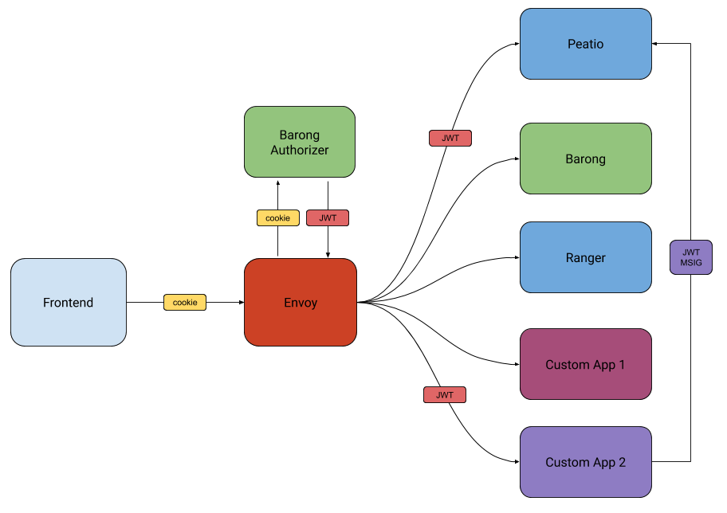

# Node JS Applogic for Rubykube stack

### Start the app
To start up the application simply run
`npm install`
`npm run start`

### Configuration
All the config is stored inside `config/config.json` file or can be defined using env variables
To have a correctly working app you also need to configure management API in barong:

* Open `management_api.yml`
* Add applogic public key to the keychains
```yaml
keychain:
  nodelogic:
    algorithm: RS256
    value: base64_encoded_public_key
```
* Add required scopes for your application.
```yaml
scopes:
	read_user:
		permitted_signers: ['nodelogic']
		mandatory_signers: ['nodelogic']
```
Now you can bring up the stack and test nodelogic application

### Testing
To verify that your Applogic is working with a Microkube installation you need to first create a session for user

You can do so by using `http` command line tool
To install *http* cli follow this [guide](https://httpie.org/#installation)

`http --session=new POST http://www.app.local/api/v2/barong/identity/sessions email='admin@barong.io' password='0lDHd9ufs9t@'`

After that you can check if applogic endpoint is working

`http --session=new POST http://www.app.local/api/v2/applogic/users/get email='john@barong.io'`

This endpoint returns a user taken from barong, the communication between applogic and barong is done using management api.

## How to develop your own Nodelogic?

Before we create the app we need to understand how the authorization and sharing session works.

Authorization flow diagram is presented below:

On a successful use login, a cookie will be set. After that thi

After JWT is decoded, the app has access to this object.

```
{ iat: 1565687278,
  exp: 1565693278,
  sub: 'session',
  iss: 'barong',
  aud: [ 'peatio', 'barong' ],
  jti: '1111111111',
  uid: 'ID123123123',
  email: 'admin@barong.io',
  role: 'admin',
  level: 3,
  state: 'active',
  referral_id: null }
```

**An already working example can be found [here](https://github.com/openware/nodelogic)**

For this tutorial we're going to extend rubykube api with another component written in Node js. This is a simple compon

1. **Create a new Express app:**

   ```zsh
   ➜  mkdir my_app
   ➜  cd my_app
   ➜  npm init --yes
   ➜  npm i express node-auth-barong
   ➜  touch app.js
   ```

2. **Create an example Server:**

   Simple server file `app.js`

```js
const express = require('express')
const barongJwt = require('node-auth-barong')
const app = express()
const port = 3000

app.use(barongJwt({barongJwtPublicKey: Buffer.from(process.env.BARONG_JWT_PUBLIC_KEY.trim(), 'base64').toString('utf-8'

app.get('/api/user/me', (req, res) => res.send(req.session.email))

app.listen(port, () => console.log(`Example app listening on port ${port}!`))

```

3. **Integrate it in microkube and test**

* Create a dockerfile for our app and build image

  ``````dockerfile
  FROM node:11.14.0-stretch

  ARG UID=1000
  ARG GID=1000

  ENV APP_HOME=/home/app

  # Create group "app" and user "app".
  RUN useradd --system --create-home --home ${APP_HOME} --shell /sbin/nologin --no-log-init app

  WORKDIR $APP_HOME
  USER app

  COPY --chown=app:app package.json package-lock.json $APP_HOME/

  # Install dependencies
  RUN npm i

  # Copy the main application.
  COPY --chown=app:app . $APP_HOME

  EXPOSE 3000

  CMD ["node","app.js"]
  ``````

   `docker build -t myapp:test .`

* Create a compose entry in microkube

  Let's change our directory to microkube

  ```
  cd ~/
  git clone git@github.com:rubykube/microkube.git
  cd microkube
  ```

  Append the following block to `templates/compose/app.yaml.erb` , by doing so we've created a new service called **mya

  ```yaml
    myapp:
      image: "<%= @config['images']['myapp'] %>"
      env_file:
        - ../config/myapp.env
      ports:
        - "3000:3000"
  ```

* Create a env file for our app

  Let's create a file `templates/config/myapp.env.erb` , stay aware of the name, because we reference it in compose fil

  ```BARONG_JWT_PUBLIC_KEY=<%= @jwt_public_key %>```

  This is the only line we need.

* Reference our app docker image in microkube/app.yml

  `````yaml
  app:
    name: "Microkube"
    domain: "app.local"
    subdomain: "www"
  ssl:
    enabled: true
    email: "support@example.com"
  images:
    peatio: rubykube/peatio:2.0.34
    barong: rubykube/barong:2.0.51
    frontend: rubykube/mikroapp:0.1.5
    myapp: myapp:test # here we specify the tag we have build our image with
    tower: rubykube/tower:0.1.8
    postmaster: quay.io/openware/postmaster:0.0.3
    arke: rubykube/arke:0.1.5
  vendor:
    frontend: https://github.com/rubykube/mikroapp.git
  storage:
    provider: "Google"
    bucketName: "microkube-barong-docs-bucket"
    accessKey: "**********"
    secretKey: "**********"
  terraform:
    credentials: "~/safe/microkube.json"
    project: "example-microkube"
    region: "europe-west4"
    zone: "europe-west4-a"
    instance_name: "microkube-cloud"
    machine_type: "n1-standard-4"
    image: "debian-cloud/debian-9"
  twilio:
    phone_number: "+15005550000"
    account_sid: "changeme"
    auth_token: "changeme"
  sendgrid_api_key: changeme
  arke:
    strategy:
      type: 'copy'
      pair: 'ETHUSD'
      target:
        driver: rubykube
        host: 'http://www.app.local'
        name: John
        key: changeme
        secret: changeme
      sources:
        - driver: bitfinex
          name: Joe
          key: changeme
          secret: changeme
  `````

* Add our application to envoy configuration

  Open `templates/config/gateway/envoy.yml.erb`

  ```yaml
  static_resources:
    listeners:
    - address:
        socket_address:
          address: 0.0.0.0
          port_value: 8099
      filter_chains:
      - filters:
        - name: envoy.http_connection_manager
          config:
            codec_type: auto
            stat_prefix: ingress_http
            route_config:
              name: local_route
              virtual_hosts:
              - name: backend
                domains:
                - "*"
                routes:
                - match:
                    prefix: "/api/v2/barong"
                  route:
                    cluster: barong
                    prefix_rewrite: "/api/v2/"
                - match:
                    prefix: "/api/v2/peatio"
                  route:
                    cluster: peatio
                    prefix_rewrite: "/api/v2/"
                - match:      # add another match for our service
                	  prefix: "/api/myapp" # this path on front
                	route:
                	  cluster: myapp # we will define this cluster below
                	  prefix_rewrite: "/api" # will rewrite to this path on our service
                - match:
                    prefix: "/admin"
                  route:
                    cluster: peatio
                - match:
                    prefix: "/assets/"
                  route:
                    cluster: peatio
                - match:
                    prefix: "/api/v2/ranger/public"
                  route:
                    cluster: ranger
                    prefix_rewrite: "/"
                    upgrade_configs:
                      upgrade_type: "websocket"
                - match:
                    prefix: "/api/v2/ranger/private"
                  route:
                    cluster: ranger
                    prefix_rewrite: "/"
                    upgrade_configs:
                      upgrade_type: "websocket"
            http_filters:
            - name: envoy.ext_authz
              config:
                http_service:
                  allowed_authorization_headers:
                  - location
                  - set-cookie
                  - authorization
                  - proxy-authenticate
                  - www-authenticate
                  allowed_request_headers:
                  - user-agent
                  - cookie
                  - x-forwarded-proto
                  - authorization
                  - proxy-authorization
                  - x-forwarded-host
                  - x-forwarded-for
                  - from
                  path_prefix: "/api/v2/auth"
                  server_uri:
                    cluster: barong
                    timeout: 1.000s
                    uri: http://barong:8001
            - name: envoy.router
              config: {}
    clusters:   # here is the set of available services to route to
    - name: barong
      connect_timeout: 0.25s
      type: strict_dns
      lb_policy: round_robin
      hosts:
      - socket_address:
          address: barong
          port_value: 8001
    - name: peatio
      connect_timeout: 0.25s
      type: strict_dns
      lb_policy: round_robin
      hosts:
      - socket_address:
          address: peatio
          port_value: 8000
    - name: myapp
      connect_timeout: 0.25s
      type: strict_dns
      lb_policy: round_robin
      hosts:
      - socket_address:
          address: myapp    # here we specify docker-compose service name because they are on the same network
          port_value: 3000 # the port we've defined in docker-compose
    - name: ranger
      connect_timeout: 0.25s
      type: strict_dns
      lb_policy: round_robin
      hosts:
      - socket_address:
          address: ranger
          port_value: 8080
  admin:
    access_log_path: "/dev/null"
    address:
      socket_address:
        address: 0.0.0.0
        port_value: 9099
  ```

* Run the application

  We need to bring up all the stack to test our app:

  `rake service:all`

  Now, let's deploy our app:

  `docker-compose up -Vd myapp`

* Test deployed application

  For easier testing let's install [httpie](https://httpie.org)

  After installing httpie we're going to create a session for a user and test our application

  * Add an entry to `/etc/hosts`

    Add this line to the file, to be able to access our application on one hostname

    ```
    0.0.0.0 www.app.local
    ```

  * Create a session

    ```json
    http --session=test POST http://www.app.local/api/v2/barong/identity/sessions email='admin@barong.io' password='0lD
    HTTP/1.1 200 OK
    Cache-Control: max-age=0, private, must-revalidate
    Content-Length: 102
    Content-Type: application/json
    Date: Tue, 13 Aug 2019 10:52:54 GMT
    Etag: W/"03851ef25f9cd7e9372e07e9fa955cc1"
    Server: envoy
    Set-Cookie: _session_id=j7aR4UMJXiCzpUIjk7VO9uZLICX%2FbWl4dB8yZRrQma9TOyquNseMXpL%2FsRvo4fR2Dth40%2BuIyku5%2F9C8DKd
    Set-Cookie: _barong_session=7ikfYh7o8gmGGqETgBAx7Nfkn0547d9bRKNkmiwz%2B4JiBh3yxT8AsDoAIZwHf3vRd%2FOp5ZCEEfcLRUnw1ig
    Vary: Origin
    X-Envoy-Upstream-Service-Time: 326
    X-Request-Id: e20b879f-3c28-4a2e-8cb2-061aa4e98acc
    X-Runtime: 0.325521

    {
        "email": "admin@barong.io",
        "level": 3,
        "otp": false,
        "role": "admin",
        "state": "active",
        "uid": "ID88613C9575"
    }
    ```

  * Test our application

    ```json
    http --session=test GET http://www.app.local/api/myapp/user/me
    HTTP/1.1 200 OK
    Content-Length: 15
    Content-Type: text/html; charset=utf-8
    Date: Tue, 13 Aug 2019 10:53:38 GMT
    Etag: W/"f-LjSPa0aKBpanEuP1qo3W6qAFJeY"
    Server: envoy
    X-Envoy-Upstream-Service-Time: 12
    X-Powered-By: Express

    admin@barong.io
    ```


#### CONGRATULATIONS! We've successfully developed our custom component for rubykube stack. Now sky is the only limit.
